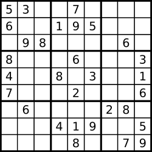

# 37 解数独

[leetCode链接](https://leetcode.cn/problems/sudoku-solver/description/)

编写一个程序，通过填充空格来解决数独问题。

数独的解法需 遵循如下规则：

数字 1-9 在每一行只能出现一次。
数字 1-9 在每一列只能出现一次。
数字 1-9 在每一个以粗实线分隔的 3x3 宫内只能出现一次。（请参考示例图）
数独部分空格内已填入了数字，空白格用 '.' 表示。

示例1


~~~
输入：board = [["5","3",".",".","7",".",".",".","."],["6",".",".","1","9","5",".",".","."],[".","9","8",".",".",".",".","6","."],["8",".",".",".","6",".",".",".","3"],["4",".",".","8",".","3",".",".","1"],["7",".",".",".","2",".",".",".","6"],[".","6",".",".",".",".","2","8","."],[".",".",".","4","1","9",".",".","5"],[".",".",".",".","8",".",".","7","9"]]
输出：[["5","3","4","6","7","8","9","1","2"],["6","7","2","1","9","5","3","4","8"],["1","9","8","3","4","2","5","6","7"],["8","5","9","7","6","1","4","2","3"],["4","2","6","8","5","3","7","9","1"],["7","1","3","9","2","4","8","5","6"],["9","6","1","5","3","7","2","8","4"],["2","8","7","4","1","9","6","3","5"],["3","4","5","2","8","6","1","7","9"]]
~~~

# 题解

该题也是回溯算法的应用之一，这里关键点在于每一次都是从0-n遍历行和列、类似于排列的那种方式。递归的三部曲如下：

一，递归的参数：只需要当前的board，递归的返回值：可以返回boolean表明是不是合法的解。
二，递归的终止条件：这里的终止条件是如果遍历完没有空格时就返回true，如果都试过了不是合法的解就返回false
三，递归的单层逻辑：

```javascript
    var solveSudokuInner = function (board) {
        for (let i = 0; i < board.length; i++) {
            for (let j = 0; j < board.length; j++) {
                if (board[i][j] === '.') {
                    for (let k = 0; k < 9; k++) {
                        const currentOption = (k + 1) + ""
                        if (isValid(board, i, j, currentOption)) {
                            board[i][j] = currentOption
                            //一直dfs，如果到底是true，那就是一个合法的解。直接返回了
                            if (solveSudokuInner(board)) {
                                return true
                            }
                            //否则回溯试上一层
                            board[i][j] = '.'
                        }
                    }
                    //9个数字都试过，那么就是没有合法的解
                    return false
                }
            }
        }
        //走到递归树最底层是一个合法解，返回true
        return true
    };
```

那么整体上这个解答是

```javascript
var solveSudoku = function (board) {
    var isValid = function (board, row, column, currentValue) {
        //行
        for (let i = 0; i < board.length; i++) {
            if (board[row][i] === currentValue) {
                return false
            }
        }
        //列
        for (let i = 0; i < board.length; i++) {
            if (board[i][column] === currentValue) {
                return false
            }
        }
        //限定9宫格
        const rowStart = Math.floor(row / 3) * 3
        const rowEnd = rowStart + 3

        const columnStart = Math.floor(column / 3) * 3
        const columnEnd = columnStart + 3

        for (let i = rowStart; i < rowEnd; i++) {
            for (let j = columnStart; j < columnEnd; j++) {
                if (board[i][j] === currentValue) {
                    return false
                }
            }
        }
        return true
    }
    var solveSudokuInner = function (board) {
        for (let i = 0; i < board.length; i++) {
            for (let j = 0; j < board.length; j++) {
                if (board[i][j] === '.') {
                    for (let k = 0; k < 9; k++) {
                        const currentOption = (k + 1) + ""
                        if (isValid(board, i, j, currentOption)) {
                            board[i][j] = currentOption
                            //如果到底了，就直接返回了
                            if (solveSudokuInner(board)) {
                                return true
                            }
                            board[i][j] = '.'
                        }
                    }
                    return false
                }
            }
        }
        return true
    };

    solveSudokuInner(board)

    //console.log(board)
}
```
