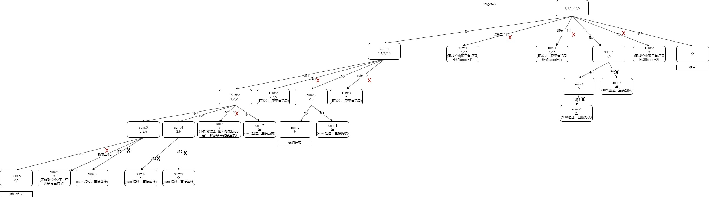

# 40 组合总和II

[leetcode链接](https://leetcode.cn/problems/combination-sum-ii/)

给定一个候选人编号的集合 candidates 和一个目标数 target ，找出 candidates 中所有可以使数字和为 target 的组合。

candidates 中的每个数字在每个组合中只能使用 一次 。

注意：解集不能包含重复的组合。 

示例 1:

~~~
输入: candidates = [10,1,2,7,6,1,5], target = 8,
输出:
[
[1,1,6],
[1,2,5],
[1,7],
[2,6]
]
~~~

示例 2：

~~~
输入: candidates = [2,1,2,1,1,5], target = 5,
输出:
[
[1,1,1,2],
[1,2,2],
[5]
]
~~~

# 题解

注意这一题的几个点
* 有重复的数字
* 每一个数字只能选择一次（重复的数字不同位置的也只能取一次）
* 结果集应该是不重复的组合（不考虑顺序）

如果暴力求解的话，可以先求出所有组合，然后在去重，但是这样会超时。所以我们需要考虑在回溯的时候剪枝来进行去重。

那我们要考虑去重怎么做。

假设我们拿示例2进行举例。我们可以走一样递归树如下图：



可以看到我们有红色的叉叉，也有黑色的叉叉。黑色的叉我们之前已经用过，当currentSum+candidates[i]>target时就剪枝。我们需要考虑红色的叉。

首先看红色的叉是否合理，假设我们candidates 是 [1,1,2],target=3.那么我们不能选第二个1，否则会出现两个[1(第一个1),2]。[1(第二个1),2]

其次看怎么实现这个判断。

我们首先定义一个used的数组。访问到candidates[i]时，将used[i]设置为true，回溯完成时used[i]设置为false.
要实现看是否是重复选择了之前的数据，首先要看candidates[i]===candidates[i-1]，其次要看used[i-1]是否为false。`false表示上一个左边兄弟节点已经递归完毕并执行了回溯，到当前节点了`。

综上，我们还是递归三部曲：

一，递归的参数。固定参数：candidates,target,当前遍历参数：currentResult,currentSum,currentIndex,used
二，递归的终止条件。当currentSum>= target 时结束递归
三，递归的单层逻辑
```javascript
//假设递归函数是combinationSum2, 参数是candidates,target,currentResult,currentSum,currentIndex,used
for(let i=currentIndex;i<candidates.length;i++) {
    //红色叉叉的剪枝逻辑
    //第一次选择肯定不重复
    //i>0时，当和前一个选择的是相同的时候，并且当前used[i-1]===false时，说明并不是一个树枝上的递归
    if (i>0 && candidates[i] === candidates[i-1] && used[i-1] === false) {
        continue;
    }

    //黑色叉叉的剪枝逻辑
    if(currentSum+candidates[i]<=target) {
        //i+1表示不能重复选择同一个位置上的
        used[i] = true
        combinationSum2(candidates,target,[...currentResult, candidates[i]],currentSum+candidates[i],i+1,used)
        used[i] = false
    }
}
```

所以综上我们的解决方案是：

```javascript
var combinationSum2 = function(candidates, target) {
    var finalResult = []
    // 构造used 数组
    var combinationSum = function(candidates, target, currentResult, currentSum, currentIndex, used) {
        if (currentSum > target) {
            return
        }
        if (currentSum === target) {
            finalResult.push([...currentResult])
            return
        }

        for(let i=currentIndex;i<candidates.length;i++) {        
            //红色叉叉的剪枝逻辑
            //第一次选择肯定不重复
            //i>0时，当和前一个选择的是相同的时候，并且当前used[i-1]===false时，说明并不是一个树枝上的递归
            if(i> 0 && candidates[i] === candidates[i-1] && used[i-1] === false) {
                continue
            }
            //黑色叉叉的剪枝逻辑
            if(currentSum + candidates[i] <= target) {
                used[i] = true
                combinationSum(candidates,target, [...currentResult, candidates[i]], currentSum + candidates[i], i+1, used)
                used[i] = false
            }
        }
    }
    //必须先排序，否则后面判断会出错
    candidates.sort()
    //定义出used数组，默认都是false
    const used = Array(candidates.length).fill(false)
    combinationSum(candidates, target, [], 0, 0, used)

    return finalResult
};
```
