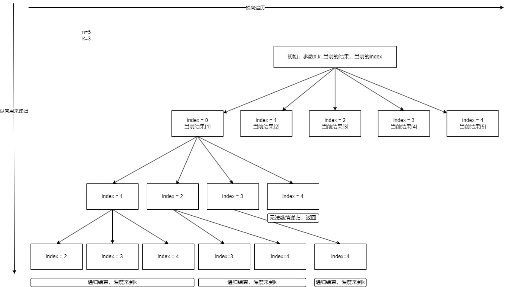

# 77 组合

给定两个整数 n 和 k，返回范围 [1, n] 中所有可能的 k 个数的组合。

你可以按 任何顺序 返回答案。

# 题解

做回溯题和递归题最主要的是把递归树画出来，然后就可以看图写代码

这题是1-n中选出不重复的k个数的组合。横向遍历的是当前可以选择的元素。纵向递归是相同的问题，但是参数不一样而已。

同时我们可以画图来增强一下理解。



解题步骤：

定义出递归的参数，n,k,currentResults,currentIndex
定义递归终止条件，currentResults.length === k 时终止递归
定义单层递归的解法。
```javascript
//假设方法是combine，参数是n,k,currentResults,currentIndex
for(let i=currentIndex;i<n;i++) {
    //这里关键的点是currentResults更新，currentIndex更新
    //currentResult更新就是添加当前的元素
    //currentIndex是下一层的起始位置，必须是当前index之后，所以是i+1
    combine(n,k, [...currentResults， i+1], i+1)
}
```

综上所述，整个题解

```javascript
var combine = function (n, k) {
    //记录最终结果
    var finalResult = [];
    var combineInner = function (n,k,currentResults,currentIndex) {
        if(currentResults.length === k) {
            finalResult.push([...currentResults])
            return
        }
        for(let i=currentIndex;i<n;i++) {
            combineInner(n,k, [...currentResults, i+1], i+1)
        }
    }
    combineInner(n,k,[], 0)
    return finalResult
}
```

